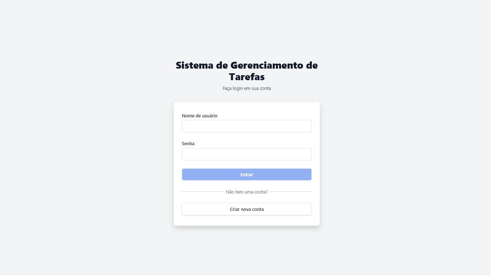
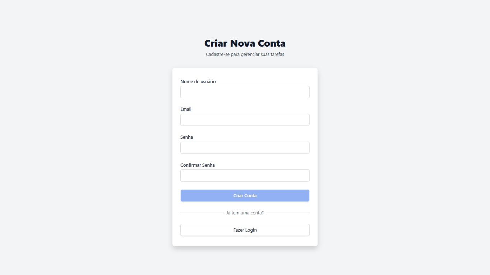
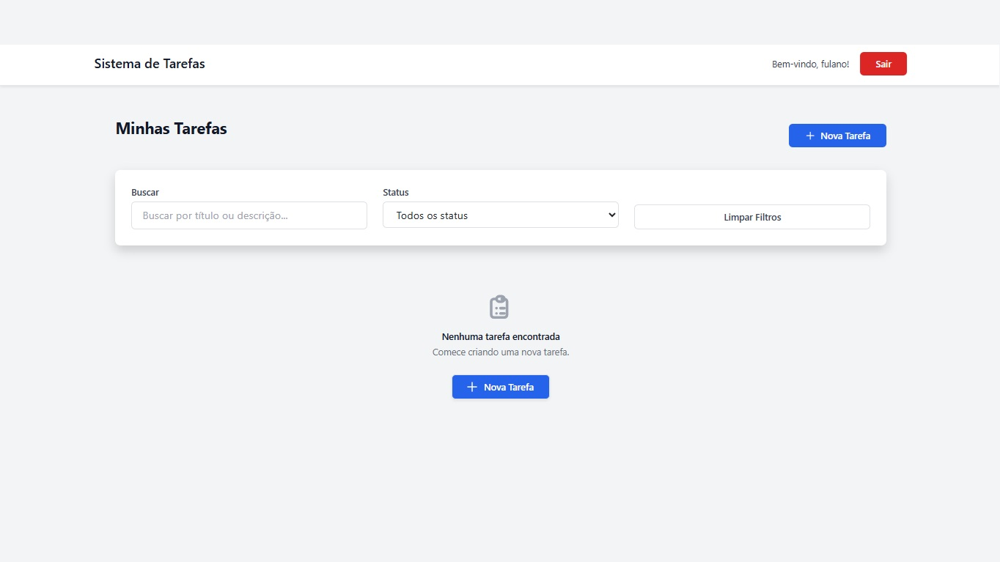
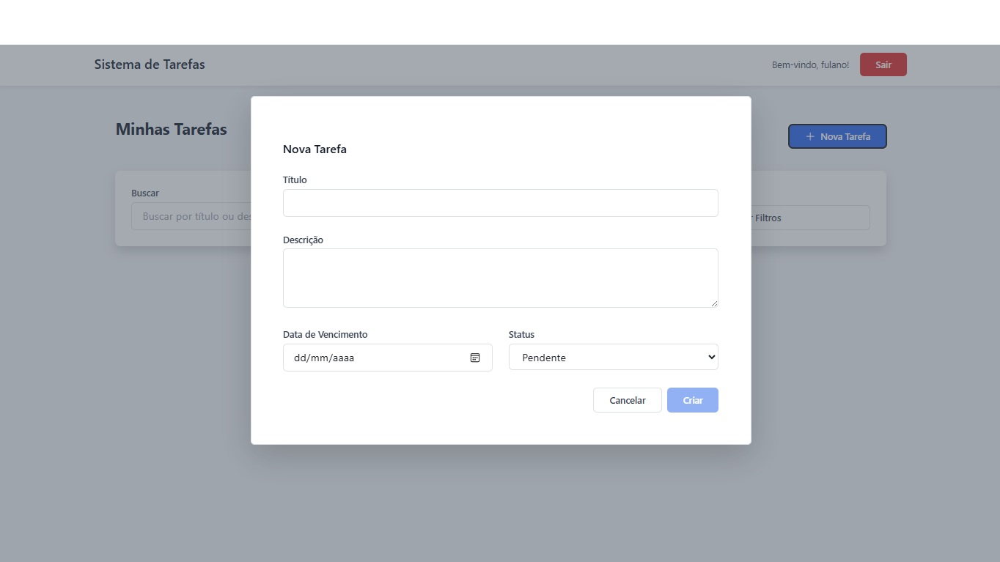
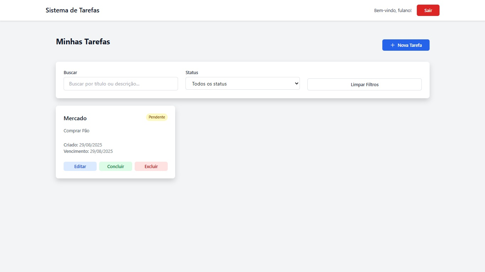

# 📝 Sistema de Gerenciamento de Tarefas

Uma aplicação full-stack de gerenciamento de tarefas construída com **Spring Boot** (backend) e **Angular** (frontend).

## 🚀 Visão Geral do Projeto

Este é um sistema completo de gerenciamento de tarefas que permite aos usuários:
- 👤 **Autenticação de Usuário** (Registro/Login com JWT)
- 📝 **Gerenciamento de Tarefas** (Criar, Ler, Atualizar, Excluir)
- 🔍 **Filtro de Tarefas** (Por status, busca por texto)
- ✅ **Conclusão de Tarefas** (Marcar tarefas como concluídas)
- 📱 **Design Responsivo** (Interface amigável para mobile)

## 🏗️ Arquitetura

```
📦 backfront/                    # Diretório raiz do projeto
├── 🍃 backend/                  # API Spring Boot
│   ├── src/main/java/           # Código fonte Java
│   │   └── com/taskmanagement/  # Pacotes da aplicação
│   ├── src/main/resources/      # Arquivos de configuração
│   ├── src/test/                # Testes unitários
│   ├── target/                  # Arquivos compilados
│   └── pom.xml                  # Dependências Maven
├── 🅰️ frontend/                # Aplicação Angular
│   ├── src/app/                 # Componentes Angular
│   ├── src/assets/              # Recursos estáticos
│   ├── dist/                    # Build de produção
│   ├── node_modules/            # Dependências npm
│   ├── package.json             # Dependências npm
│   ├── angular.json             # Configurações Angular
│   └── tailwind.config.js       # Configurações Tailwind
├── 🚫 .gitignore                # Regras centralizadas do Git
└── 📖 README.md                 # Documentação completa (pt-br)
```

## 🛠️ Stack Tecnológico

### Backend (Spring Boot)
- ☕ **Java 17**
- 🍃 **Spring Boot 3.1.5**
- 🔧 **Maven** (Gerenciamento de Dependências)
- 🗄️ **Banco H2** (Em memória)
- 🔐 **Autenticação JWT**
- 📚 **Swagger/OpenAPI** (Documentação interativa com autenticação JWT)
- ✅ **JUnit + Mockito** (Testes)

### Frontend (Angular)
- 🅰️ **Angular 16**
- 📘 **TypeScript**
- 🎨 **Tailwind CSS + Bootstrap** (Estilização)
- 🔄 **RxJS** (Gerenciamento de Estado)
- 🌐 **HttpClient** (Comunicação com API)
- 📱 **Design Responsivo**

## 🚀 Começando

### 📋 Pré-requisitos
- ☕ **Java 17+**
- 🔧 **Maven 3.6+**
- 🟢 **Node.js 16+**
- 📦 **npm 8+**
- 🌐 **Git**

### 📥 Clonagem e Configuração Local

#### **1. Clone o Repositório:**
```bash
git clone https://github.com/gimidia/backfront.git
cd backfront
```

#### **2. Configuração e Execução do Backend:**
```bash
# Navegar para o diretório do backend
cd backend

# Instalar dependências e compilar
mvn clean install

# Executar o servidor Spring Boot
mvn spring-boot:run
```

**✅ Backend rodando em:** http://localhost:8080
- 📚 **Swagger UI:** http://localhost:8080/swagger-ui.html
- 🗄️ **H2 Console:** http://localhost:8080/h2-console

#### **3. Configuração e Execução do Frontend (novo terminal):**
```bash
# Navegar para o diretório do frontend
cd frontend

# Instalar dependências npm
npm install

# Executar o servidor de desenvolvimento Angular
ng serve
```

**✅ Frontend rodando em:** http://localhost:4200

> 💡 **Importante:** Mantenha ambos os terminais abertos. O backend (porta 8080) deve estar rodando antes de usar o frontend (porta 4200).

### ⚡ Execução Rápida

Para executar ambos os serviços rapidamente:

```bash
# Terminal 1 - Backend
cd backend && mvn spring-boot:run

# Terminal 2 - Frontend  
cd frontend && npm install && ng serve
```

### 🔧 Configuração Manual Detalhada

### 🍃 Configuração Manual do Backend

1. **Navegue para o diretório do backend:**
   ```bash
   cd backend
   ```

2. **Instale as dependências e execute:**
   ```bash
   mvn clean install
   mvn spring-boot:run
   ```

3. **Verifique se o backend está executando:**
   - API: http://localhost:8080
   - Swagger UI: http://localhost:8080/swagger-ui.html
   - Console H2: http://localhost:8080/h2-console

### 🅰️ Configuração Manual do Frontend

1. **Navegue para o diretório do frontend:**
   ```bash
   cd frontend
   ```

2. **Instale as dependências:**
   ```bash
   npm install
   ```

3. **Execute o servidor de desenvolvimento:**
   ```bash
   ng serve
   ```

4. **Acesse a aplicação:**
   - Frontend: http://localhost:4200

## 📡 Endpoints da API

### Autenticação
- `POST /api/auth/signup` - Registrar novo usuário
- `POST /api/auth/signin` - Login do usuário

### Tarefas (Requer Token JWT)
- `GET /api/tasks` - Listar todas as tarefas do usuário
- `POST /api/tasks` - Criar nova tarefa
- `GET /api/tasks/{id}` - Obter tarefa por ID
- `PUT /api/tasks/{id}` - Atualizar tarefa
- `PUT /api/tasks/{id}/complete` - Marcar tarefa como concluída
- `DELETE /api/tasks/{id}` - Excluir tarefa

### Parâmetros de Consulta
- `GET /api/tasks?status=PENDENTE` - Filtrar por status
- `GET /api/tasks?search=palavra-chave` - Buscar tarefas

## 🏃‍♂️ Executando a Aplicação

### Opção 1: Modo de Desenvolvimento

1. **Iniciar Backend:**
   ```bash
   cd backend
   mvn spring-boot:run
   ```

2. **Iniciar Frontend (em outro terminal):**
   ```bash
   cd frontend
   ng serve
   ```

3. **Acessar:**
   - Frontend: http://localhost:4200
   - API Backend: http://localhost:8080
   - Documentação da API: http://localhost:8080/swagger-ui.html

### Opção 2: Build de Produção

1. **Build do Frontend:**
   ```bash
   cd frontend
   ng build --prod
   ```

2. **Build do Backend:**
   ```bash
   cd backend
   mvn clean package
   java -jar target/task-management-api-0.0.1-SNAPSHOT.jar
   ```

## 🧪 Testes

### Testes do Backend
```bash
cd backend
mvn test
```

### Testes do Frontend
```bash
cd frontend
ng test
```

## 🔐 Fluxo de Autenticação

1. **Registro/Login do Usuário** → Obter Token JWT
2. **Incluir JWT nos Headers:** `Authorization: Bearer <token>`
3. **Acessar Endpoints Protegidos** com token válido

## 📱 Funcionalidades

### ✅ Gerenciamento de Usuários
- [x] Registro de usuário com validação
- [x] Login de usuário com autenticação JWT
- [x] Armazenamento seguro de token
- [x] Redirecionamento automático após login

### ✅ Gerenciamento de Tarefas
- [x] Criar tarefas com título, descrição, data de vencimento
- [x] Visualizar todas as tarefas no dashboard
- [x] Editar tarefas existentes
- [x] Marcar tarefas como concluídas
- [x] Excluir tarefas
- [x] Acompanhamento de status de tarefas (Pendente, Em Andamento, Concluída)

### ✅ Experiência do Usuário
- [x] Design responsivo (amigável para mobile)
- [x] Filtro de tarefas por status
- [x] Funcionalidade de busca de tarefas
- [x] Estados de carregamento e tratamento de erros
- [x] Notificações de sucesso/erro
- [x] Validação de formulários

## 📱 Telas do Backend(Spring Boot/Swagger) e Frontend(Angular)

### 🍃 Backend - Swagger API Documentation


*Documentação interativa da API com autenticação JWT integrada*

### 🅰️ Frontend - Aplicação Angular

#### 🔐 Tela de Login

*Interface de autenticação do usuário*

#### 📝 Tela de Nova Conta

*Formulário de registro de novo usuário*

#### 🏠 Dashboard Principal

*Painel principal com listagem de tarefas*

#### ➕ Nova Tarefa

*Formulário para criação de nova tarefa*

#### ✏️ Gerenciar Tarefas

*Interface para edição e gerenciamento de tarefas*

> 💡 **Interface Responsiva**: Todas as telas são otimizadas para desktop e dispositivos móveis usando Tailwind CSS e Bootstrap.

## 🗄️ Schema do Banco de Dados

### Tabela Users
```sql
CREATE TABLE users (
    id BIGINT PRIMARY KEY,
    username VARCHAR(50) UNIQUE NOT NULL,
    email VARCHAR(255) UNIQUE NOT NULL,
    password VARCHAR(255) NOT NULL,
    created_at TIMESTAMP
);
```

### Tabela Tasks
```sql
CREATE TABLE tasks (
    id BIGINT PRIMARY KEY,
    titulo VARCHAR(100) NOT NULL,
    descricao VARCHAR(500),
    data_criacao TIMESTAMP,
    data_vencimento TIMESTAMP NOT NULL,
    status VARCHAR(20) CHECK (status IN ('PENDENTE','EM_ANDAMENTO','CONCLUIDA')),
    user_id BIGINT,
    FOREIGN KEY (user_id) REFERENCES users(id)
);
```

## 📚 Documentação da API

Acesse a documentação interativa da API em:
**http://localhost:8080/swagger-ui.html**

### 🔐 Usando Autenticação JWT no Swagger

1. **Registre um usuário** usando o endpoint `/api/auth/signup`
2. **Faça login** usando o endpoint `/api/auth/signin` e copie o token retornado
3. **Clique no botão "Authorize" (🔒)** no topo da página do Swagger
4. **No campo "Value", insira:** `Bearer seu-token-aqui`
5. **Clique em "Authorize"** para aplicar o token
6. **Agora você pode testar todos os endpoints protegidos de tarefas!**

> 💡 **Dica:** Os endpoints com ícone de cadeado (🔒) requerem autenticação JWT

## 🗄️ Acesso ao Banco de Dados H2

O projeto utiliza banco H2 em memória para desenvolvimento e demonstração. Você pode acessar o console web do H2 para visualizar e manipular os dados.

### 📋 Pré-requisitos
- Backend Spring Boot em execução (`mvn spring-boot:run`)
- Navegador web

### 🔗 Acessando o H2 Console

1. **Inicie o Backend:**
   ```bash
   cd backend
   mvn spring-boot:run
   ```

2. **Acesse o Console H2:**
   Abra seu navegador e vá para:
   ```
   http://localhost:8080/h2-console
   ```

### ⚙️ Configurações de Login

Quando a página de login do H2 aparecer, use estas configurações:

| Campo | Valor |
|-------|-------|
| **JDBC URL** | `jdbc:h2:mem:testdb` |
| **User Name** | `sa` |
| **Password** | *(deixe em branco)* |
| **Driver Class** | `org.h2.Driver` *(preenchido automaticamente)* |

### 🔑 Passos para Login

1. **Verifique a JDBC URL:** Deve estar como `jdbc:h2:mem:testdb`
2. **Username:** Digite `sa`
3. **Password:** Deixe o campo vazio
4. **Clique em "Connect"**

### 📊 O que Você Verá

Após o login bem-sucedido, você terá acesso a:

- **📋 Tabelas Disponíveis:**
  - `USERS` - Informações dos usuários cadastrados
  - `TASKS` - Tarefas criadas pelos usuários

- **🔍 Funcionalidades:**
  - Executar consultas SQL personalizadas
  - Visualizar estrutura das tabelas
  - Inserir, atualizar ou deletar registros
  - Monitorar dados em tempo real

### 💻 Consultas SQL Úteis

```sql
-- Visualizar todos os usuários
SELECT * FROM USERS;

-- Visualizar todas as tarefas
SELECT * FROM TASKS;

-- Tarefas com informações do usuário
SELECT t.titulo, t.descricao, t.status, u.username 
FROM TASKS t 
JOIN USERS u ON t.user_id = u.id;

-- Contar tarefas por status
SELECT status, COUNT(*) as quantidade 
FROM TASKS 
GROUP BY status;
```

### ⚠️ Observações Importantes

- **Dados Temporários:** O H2 está configurado em modo memória (`mem:testdb`)
- **Perda de Dados:** Todos os dados são perdidos quando o backend é reiniciado
- **Ideal para:** Desenvolvimento, testes e demonstrações
- **Sincronização:** Mudanças feitas via API são visíveis imediatamente no console H2

### 🐛 Solução de Problemas H2

**Não consegue conectar?**
- Verifique se o backend está rodando na porta 8080
- Confirme a JDBC URL: `jdbc:h2:mem:testdb`
- Certifique-se de que o username é `sa` e password está vazio

**Tabelas não aparecem?**
- Execute uma operação na API primeiro (registrar usuário, criar tarefa)
- As tabelas são criadas automaticamente pelo JPA/Hibernate

## 🛡️ Segurança

- **Autenticação JWT** para acesso seguro à API
- **Criptografia de senha** usando BCrypt
- **Configuração CORS** para requisições cross-origin
- **Validação de entrada** em todos os endpoints
- **Proteção contra injeção SQL** via JPA/Hibernate
- **Swagger com autenticação JWT integrada** para testes seguros da API

## 🔧 Configuração

### Configuração do Backend (`application.properties`)
```properties
# Servidor
server.port=8080

# Banco H2
spring.datasource.url=jdbc:h2:mem:testdb
spring.h2.console.enabled=true

# JWT
jwt.secret=sua-chave-secreta
jwt.expiration=86400000

# Swagger/OpenAPI
springdoc.api-docs.path=/api-docs
springdoc.swagger-ui.path=/swagger-ui.html
```

### Configuração do Frontend
- **URL Base da API:** `http://localhost:8080`
- **Armazenamento JWT:** localStorage (seguro)
- **Roteamento:** Angular Router com guards

## 🐛 Solução de Problemas

### 🚀 Problemas de Primeira Execução

**💻 Após clonar o repositório:**

1. **Erro "Java not found":**
   - Verifique se o Java 17+ está instalado: `java -version`
   - Configure a variável JAVA_HOME se necessário

2. **Erro "Maven not found":**
   - Instale Maven ou use o wrapper: `./mvnw` (Linux/Mac) ou `.\mvnw` (Windows)

3. **Erro "Node.js not found":**
   - Instale Node.js 16+ de: https://nodejs.org
   - Verifique: `node -v` e `npm -v`

4. **Erro "ng not found":**
   ```bash
   npm install -g @angular/cli
   ```

### 🛠️ Problemas Comuns

1. **Backend não está iniciando:**
   - Verifique a versão do Java (17+)
   - Verifique se a porta 8080 está disponível
   - Verifique as dependências do Maven

2. **Erros de compilação do frontend:**
   - Execute `npm install` para atualizar dependências
   - Verifique a versão do Node.js (16+)
   - Limpe o cache do npm: `npm cache clean --force`

3. **Erros de CORS:**
   - O CORS do backend está configurado para localhost:4200
   - Verifique se as URLs da API do frontend apontam para localhost:8080

4. **Problemas de autenticação:**
   - Verifique o formato do token JWT
   - Verifique a expiração do token
   - Certifique-se do formato correto do header Authorization

## 💭 Comentários

### 🎯 Decisões Técnicas

#### **Backend (Spring Boot)**
- **JWT Authentication**: Escolhido por ser stateless e escalável, ideal para APIs RESTful
- **H2 Database**: Banco em memória perfeito para demonstração e desenvolvimento rápido
- **Spring Security**: Framework robusto que oferece segurança enterprise-grade
- **Maven**: Gerenciador de dependências maduro e amplamente adotado no ecossistema Java
- **Swagger/OpenAPI**: Documentação automática que facilita testes e integração

#### **Frontend (Angular)**
- **Angular 16**: Framework estruturado ideal para aplicações enterprise
- **Tailwind CSS + Bootstrap**: Combinação que oferece flexibilidade e componentes prontos
- **RxJS**: Programação reativa essencial para gerenciamento de estado assíncrono
- **TypeScript**: Type safety que reduz bugs e melhora a manutenibilidade
- **Guards**: Proteção de rotas que garante segurança no lado cliente

### 🤖 Uso de IA no Desenvolvimento

> 🛠️ **Ferramenta Utilizada**: Qoder IDE - Assistente de desenvolvimento com IA integrada

#### **Aceleração do Backend**
- **Geração de Código**: Qoder auxiliou na criação de controllers, services e repositories
- **Configuração de Segurança**: Assistência na configuração complexa do Spring Security
- **Documentação Swagger**: Geração automática de anotações OpenAPI
- **Tratamento de Erros**: Padrões de exception handling e validação
- **Testes Unitários**: Estrutura base para testes com JUnit e Mockito

#### **Aceleração do Frontend**
- **Componentes Angular**: Geração rápida de components, services e guards
- **Styling Responsivo**: Implementação eficiente com Tailwind CSS
- **Formulários Reativos**: Configuração de validação e binding de dados
- **Roteamento**: Setup completo de rotas protegidas e navegação
- **Integração HTTP**: Services para comunicação com backend

#### **Benefícios Observados com Qoder**
- ⚡ **Velocidade**: Desenvolvimento 3-4x mais rápido que manualmente
- 🎯 **Qualidade**: Código seguindo best practices desde o início
- 📚 **Aprendizado**: Qoder explicou conceitos complexos durante desenvolvimento
- 🔧 **Debugging**: Assistência na identificação e correção de bugs
- 📖 **Documentação**: Geração automática de comentários e README

#### **Limitações e Cuidados**
- 🔍 **Revisão Necessária**: Todo código gerado foi revisado e testado
- 🧠 **Conhecimento Base**: IA complementa, não substitui conhecimento técnico
- 🔐 **Segurança**: Configurações de segurança foram validadas manualmente
- 🎨 **Customização**: Ajustes específicos do projeto feitos manualmente

### 📝 Lições Aprendidas

1. **IA como Ferramenta**: Mais eficaz quando usada como assistente, não como substituto
2. **Iteração Rápida**: Prototipagem acelerada permite mais tempo para refinamento
3. **Padrões Consistentes**: IA ajuda a manter consistência arquitetural
4. **Foco no Negócio**: Menos tempo em boilerplate, mais tempo em funcionalidades
5. **Documentação Viva**: IA facilita manter documentação atualizada

## 📄 Licença

Este projeto é apenas para fins de estudo/demonstração.

---

**🎉 Bom Gerenciamento de Tarefas!** 📝✅